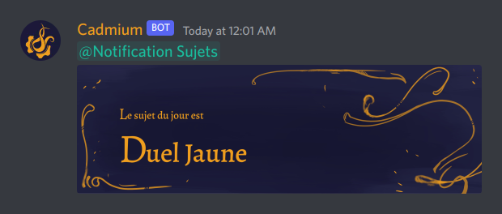

<h1>Cadmium</h1>

Discord bot for the french server [*La Forge Indigo*](https://discord.gg/NVvpe8S52F).

> **Warning**  
> This bot is designed for the french language and probably won't work as expected with other languages due to its inflections engine

# Run

- Install the dependencies: `pip install -r requirements.txt`
- Download the inflection dictionary: `python3 -m cadmium.inflect.dictionary.download`
- Rename `.env.sample` to `.env` and complete it
- Run the bot: `python3 -m cadmium`
